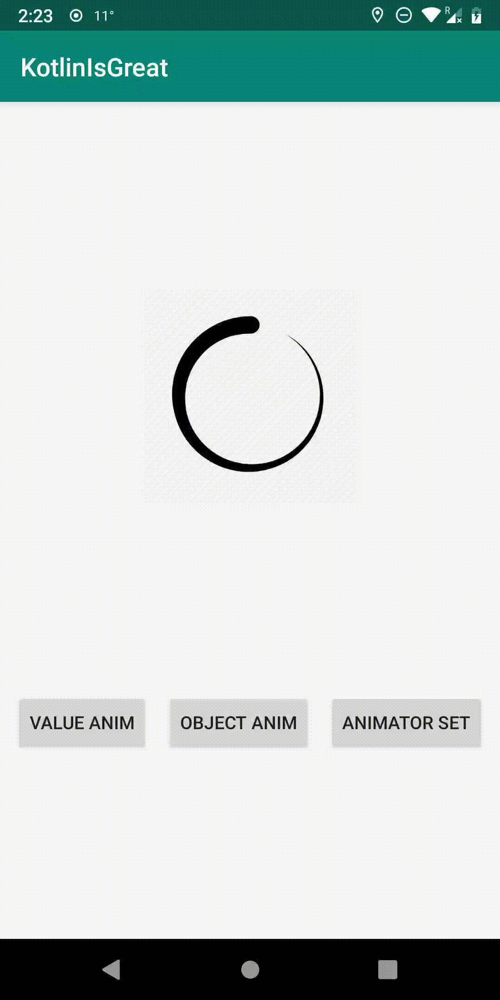

# KotlinIsGreat
This repository aims to use kotlin to implement or combine some functionality which I think are good.

## DSL Animator
With this tool, you can write the animator in a DSL style which has a more clearly structure to read and easier to write.

### Code samples:

- ValueAnimator
```kotlin
val valueAnimator =
    valueAnim {
        duration = 1000L
        values = floatArrayOf(0f, 360f)
        repeatMode = ValueAnimator.RESTART
        repeatCount = ValueAnimator.INFINITE
        evaluator { fraction, startValue, endValue ->
            (endValue as Float - startValue as Float) * fraction
        }
        action {
            ivLoading.rotation = it as Float
        }
    }
valueAnimator.start()
```
- ObjectAnimator
```kotlin
val objectAnimator = 
    objectAnim {
        target = ivLoading
        duration = 1000L
        interpolator = AccelerateInterpolator()
        property {
            propertyName = "rotation"
            values = floatArrayOf(0f, 360f)
        }
        property {
            propertyName = "scaleX"
            values = floatArrayOf(1f, 1.1f, 1.3f, 1.1f, 1f)
        }
    }
objectAnimator.start()
```
- AnimatorSet
```kotlin
val animatorSet = 
    animSet {
        duration = 1000L
        interpolator = BounceInterpolator()
        valueAnim {
            values = floatArrayOf(0f, 1f)
            evaluator { fraction, startValue, endValue ->
                (endValue as Float - startValue as Float) * fraction
            }
            action {
                ivLoading.alpha = it as Float
            }
        }
        objectAnim {
            target = ivLoading
            keyframes {
                propertyName = "rotation"
                floatKeyFrame(0f, 0f)
                floatKeyFrame(0.4f, 180f)
                floatKeyFrame(1f, 360f)
            }
        }
    }
animatorSet.start()
```

### Screenshots

- ValueAnimator


- ObjectAnimator


- AnimatorSet

